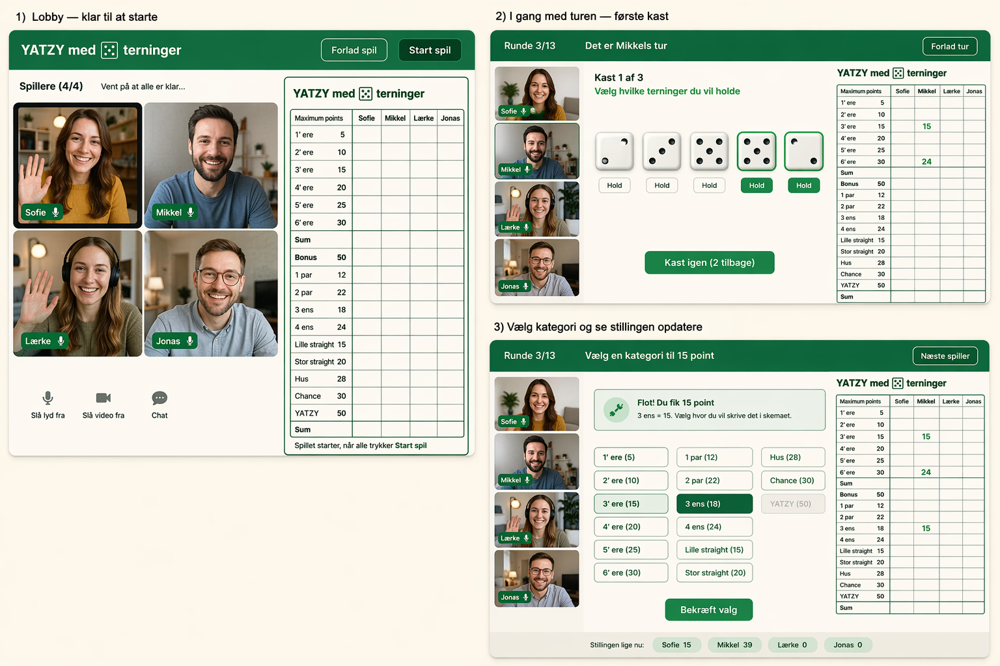

# Online Yatzy i .NET MAUI til Android
_Aktualiseret som teknisk implementeringsguide til en C# / MAUI / .NET-udvikler_

## Formål
Denne guide beskriver, hvordan du kan implementere en **online Yatzy-app i .NET MAUI til Android** med udgangspunkt i reglerne fra de uploadede billeder og det UI-princip, der minder om den klassiske papirblok.

Målet er en app hvor:

- op til **4 spillere** kan spille mod hinanden online
- alle deltagere kan **se og høre hinanden live**
- virtuelle terninger bliver **vist og animeret**
- hver spiller har **op til 3 kast**
- spilleren kan **holde terninger** mellem kast
- pointarket visuelt minder om den analoge Yatzy-blok

---

## UX-retning fra de uploadede billeder

Det vigtigste designgreb fra billede 2 er, at **scorekortet er centrum**.  
I stedet for at lave et rent casino-look bør du bygge oplevelsen som en digital version af et fælles Yatzy-ark kombineret med live video.

### Designprincipper
- Brug den klassiske **grønne Yatzy-farve** som primær identitet
- Scorekortet skal ligne en **digital papirblok**
- Videofeeds skal være tydelige, men ikke dominere over spillet
- Terninger skal have en tydelig fysisk fornemmelse
- Det skal være meget klart:
  - hvem der har tur
  - hvor mange kast der er tilbage
  - hvilke terninger der er holdt
  - hvilke kategorier der stadig er ledige

---

## Indsat mockup

Nedenfor er de 3 skærmretninger, som kan bruges som udgangspunkt for UX og layout.



---

## Anbefalet løsningsarkitektur

Jeg vil anbefale at splitte løsningen i **tre dele**:

1. **.NET MAUI Android app**
2. **ASP.NET Core backend**
3. **Realtime/video lag**

### 1) MAUI app
Ansvar:
- login / spilleridentitet
- lobby
- visning af videofeeds
- visning af scoreark
- terningekast UI
- valg af kategori
- lokal rendering af game state

### 2) ASP.NET Core backend
Ansvar:
- oprette spilrum
- holde styr på spillere
- validere tur-rækkefølge
- gemme game state
- validere scoring
- udsende realtime events

### 3) Realtime/video
Til spiltilstand:
- **SignalR** er det oplagte valg

Til livestream/video:
- brug **WebRTC** via en ekstern tjeneste eller SDK  
  Eksempler på realistiske valg:
  - Azure Communication Services
  - Agora
  - Daily
  - Twilio Video
  - 100ms

I en MAUI-app er video-delen typisk det sværeste område. Derfor er det en god idé at vælge en færdig videotjeneste med Android-understøttelse frem for at bygge rå WebRTC helt selv.

---

## Teknologistak

### Frontend
- .NET 8 / .NET MAUI
- MVVM
- CommunityToolkit.Mvvm
- CommunityToolkit.Maui
- SkiaSharp eller MAUI Graphics til evt. terningeanimationer
- SignalR .NET client

### Backend
- ASP.NET Core Web API
- SignalR Hub
- Entity Framework Core
- SQL Server eller PostgreSQL
- Redis valgfrit til skalering / session / pub-sub

### Video
- SDK fra valgt videotjeneste
- Alternativt et `BlazorWebView`-baseret video-layer, hvis SDK-støtten i ren MAUI er begrænset

---

## Foreslået projektstruktur

```text
src/
  Yatzy.Mobile/
    Views/
    ViewModels/
    Models/
    Services/
    Components/
    Resources/
  Yatzy.Api/
    Controllers/
    Hubs/
    Services/
    Domain/
    Infrastructure/
    Persistence/
  Yatzy.Shared/
    Contracts/
    DTOs/
    Enums/
    Rules/
```

---

## Domænemodel

### Centrale entiteter

```csharp
public class GameRoom
{
    public Guid Id { get; set; }
    public string RoomCode { get; set; } = "";
    public GameStatus Status { get; set; }
    public int CurrentPlayerIndex { get; set; }
    public int RoundNumber { get; set; }
    public List<Player> Players { get; set; } = new();
    public List<DiceState> Dice { get; set; } = new();
    public DateTime CreatedUtc { get; set; }
}
```

```csharp
public class Player
{
    public Guid Id { get; set; }
    public string DisplayName { get; set; } = "";
    public string ConnectionId { get; set; } = "";
    public ScoreSheet ScoreSheet { get; set; } = new();
    public bool IsConnected { get; set; }
}
```

```csharp
public class DiceState
{
    public int Position { get; set; }
    public int Value { get; set; }
    public bool IsHeld { get; set; }
}
```

```csharp
public class TurnState
{
    public Guid GameRoomId { get; set; }
    public Guid PlayerId { get; set; }
    public int RollNumber { get; set; } // 1..3
    public bool HasRolled { get; set; }
}
```

---

## Scoreark-model

Brug en enum til kategorier:

```csharp
public enum ScoreCategory
{
    Ones,
    Twos,
    Threes,
    Fours,
    Fives,
    Sixes,
    OnePair,
    TwoPairs,
    ThreeOfAKind,
    FourOfAKind,
    SmallStraight,
    LargeStraight,
    FullHouse,
    Chance,
    Yatzy
}
```

En scorelinje:

```csharp
public class ScoreEntry
{
    public ScoreCategory Category { get; set; }
    public int? Points { get; set; }
}
```

ScoreSheet:

```csharp
public class ScoreSheet
{
    public List<ScoreEntry> Entries { get; set; } = new();

    public int UpperSectionSum =>
        Entries.Where(x =>
            x.Category == ScoreCategory.Ones ||
            x.Category == ScoreCategory.Twos ||
            x.Category == ScoreCategory.Threes ||
            x.Category == ScoreCategory.Fours ||
            x.Category == ScoreCategory.Fives ||
            x.Category == ScoreCategory.Sixes)
        .Sum(x => x.Points ?? 0);

    public int Bonus => UpperSectionSum >= 63 ? 50 : 0;

    public int LowerSectionSum =>
        Entries.Where(x =>
            x.Category != ScoreCategory.Ones &&
            x.Category != ScoreCategory.Twos &&
            x.Category != ScoreCategory.Threes &&
            x.Category != ScoreCategory.Fours &&
            x.Category != ScoreCategory.Fives &&
            x.Category != ScoreCategory.Sixes)
        .Sum(x => x.Points ?? 0);

    public int Total => UpperSectionSum + Bonus + LowerSectionSum;
}
```

---

## Regler som skal implementeres

Ud fra dit uploadede billede skal du bruge disse regler:

### Øvre sektion
- 1'ere = summen af alle 1'ere
- 2'ere = summen af alle 2'ere
- 3'ere = summen af alle 3'ere
- 4'ere = summen af alle 4'ere
- 5'ere = summen af alle 5'ere
- 6'ere = summen af alle 6'ere
- bonus = **50** hvis summen er **63 eller mere**

### Nedre sektion
- 1 par = højeste par
- 2 par = to forskellige par
- 3 ens = tre ens
- 4 ens = fire ens
- lille straight = 1-2-3-4-5 = 15
- stor straight = 2-3-4-5-6 = 20
- fuldt hus = 3 ens + 2 ens
- chancen = sum af alle terninger
- yatzy = 5 ens = 50

---

## Regelmotor

Lav regelmotoren i et separat bibliotek, fx `Yatzy.Shared` eller `Yatzy.Rules`.

```csharp
public interface IScoreCalculator
{
    int? Calculate(ScoreCategory category, IReadOnlyList<int> dice);
}
```

Eksempel på start:

```csharp
public class ScoreCalculator : IScoreCalculator
{
    public int? Calculate(ScoreCategory category, IReadOnlyList<int> dice)
    {
        var sorted = dice.OrderBy(x => x).ToList();
        var groups = dice.GroupBy(x => x)
                         .ToDictionary(g => g.Key, g => g.Count());

        return category switch
        {
            ScoreCategory.Ones => dice.Where(x => x == 1).Sum(),
            ScoreCategory.Twos => dice.Where(x => x == 2).Sum(),
            ScoreCategory.Threes => dice.Where(x => x == 3).Sum(),
            ScoreCategory.Fours => dice.Where(x => x == 4).Sum(),
            ScoreCategory.Fives => dice.Where(x => x == 5).Sum(),
            ScoreCategory.Sixes => dice.Where(x => x == 6).Sum(),

            ScoreCategory.OnePair => CalculateOnePair(dice, groups),
            ScoreCategory.TwoPairs => CalculateTwoPairs(groups),
            ScoreCategory.ThreeOfAKind => CalculateNOfAKind(groups, 3),
            ScoreCategory.FourOfAKind => CalculateNOfAKind(groups, 4),
            ScoreCategory.SmallStraight => sorted.SequenceEqual(new[] { 1, 2, 3, 4, 5 }) ? 15 : 0,
            ScoreCategory.LargeStraight => sorted.SequenceEqual(new[] { 2, 3, 4, 5, 6 }) ? 20 : 0,
            ScoreCategory.FullHouse => CalculateFullHouse(groups),
            ScoreCategory.Chance => dice.Sum(),
            ScoreCategory.Yatzy => groups.Any(g => g.Value == 5) ? 50 : 0,
            _ => 0
        };
    }

    private static int CalculateOnePair(IReadOnlyList<int> dice, Dictionary<int, int> groups)
    {
        return groups.Where(x => x.Value >= 2)
                     .OrderByDescending(x => x.Key)
                     .Select(x => x.Key * 2)
                     .FirstOrDefault();
    }

    private static int CalculateTwoPairs(Dictionary<int, int> groups)
    {
        var pairs = groups.Where(x => x.Value >= 2)
                          .OrderByDescending(x => x.Key)
                          .Take(2)
                          .ToList();

        return pairs.Count == 2 ? pairs.Sum(x => x.Key * 2) : 0;
    }

    private static int CalculateNOfAKind(Dictionary<int, int> groups, int count)
    {
        return groups.Where(x => x.Value >= count)
                     .OrderByDescending(x => x.Key)
                     .Select(x => x.Key * count)
                     .FirstOrDefault();
    }

    private static int CalculateFullHouse(Dictionary<int, int> groups)
    {
        var hasThree = groups.Any(x => x.Value == 3);
        var hasTwo = groups.Any(x => x.Value == 2);

        return hasThree && hasTwo
            ? groups.Sum(x => x.Key * x.Value)
            : 0;
    }
}
```

---

## Spilflow

Hver spiller har én tur pr. runde.

### Turflow
1. Spilleren starter sin tur
2. Alle 5 terninger er aktive
3. Spilleren kaster første gang
4. Spilleren kan markere én eller flere terninger som **hold**
5. Spilleren kan kaste igen
6. Spilleren kan igen vælge hold
7. Spilleren kan kaste tredje gang
8. Spilleren vælger en scorekategori
9. Kategori låses
10. Næste spiller får tur

### Vigtige regler
- Man må højst kaste **3 gange**
- Man må kun udfylde **én kategori per tur**
- En kategori kan kun bruges **én gang**
- Hvis spilleren ikke kan eller vil bruge en god kategori, skal en tom kategori udfyldes med **0**

---

## Realtime events med SignalR

Definér events som fx:

```csharp
public static class HubEvents
{
    public const string PlayerJoined = "PlayerJoined";
    public const string PlayerLeft = "PlayerLeft";
    public const string GameStarted = "GameStarted";
    public const string TurnStarted = "TurnStarted";
    public const string DiceRolled = "DiceRolled";
    public const string HoldChanged = "HoldChanged";
    public const string ScoreSelected = "ScoreSelected";
    public const string ScoreboardUpdated = "ScoreboardUpdated";
    public const string GameEnded = "GameEnded";
}
```

### Hvad backend skal validere
Backend må aldrig stole på klienten.

Serveren skal validere:
- at det er spillerens tur
- at spilleren ikke har overskredet 3 kast
- at hold-state er gyldig
- at valgt kategori er ledig
- at beregnet score matcher serverens egen regelmotor

---

## Video/livestream

Fordi video er vigtigst i denne app, bør du tænke den som et **førsteklasses feature**.

### Minimumskrav
- 4 samtidige videofeeds
- mute/unmute
- kamera on/off
- evt. netværksindikator
- fallback til avatar hvis kamera er slået fra
- tydelig markering af aktiv spiller

### Layoutidé
- På tablet: videofeeds i venstre side, scorekort og terninger til højre
- På mobil portrait:
  - øverst: aktiv spiller + rundeinfo
  - derefter: videokarrusel eller 2x2 grid
  - midt: terninger
  - nederst: scorekort / kategori-valg

### Praktisk anbefaling
Hvis du vil lykkes hurtigere:
- brug en hosted video-platform
- brug SignalR til game state
- undgå at blande selve spilreglerne sammen med video-session-logikken

---

## Skærme du bør bygge

### 1. Lobby
Indhold:
- room code
- liste over spillere
- video-preview
- klar-status
- start spil-knap
- chat eller quick emotes valgfrit

### 2. Aktiv tur
Indhold:
- hvem har tur
- kast 1 af 3 / 2 af 3 / 3 af 3
- de 5 terninger
- hold-knapper
- kast igen-knap
- mini-scorekort

### 3. Vælg kategori
Indhold:
- liste over ledige kategorier
- preview af point for hver kategori
- bekræft valg
- opdateret scoreboard

### 4. Slutresultat
Indhold:
- samlet score
- placering 1-4
- mulighed for nyt spil

---

## MAUI UI-opdeling

### Views
- `LobbyPage.xaml`
- `GamePage.xaml`
- `ScoreSelectionPage.xaml` eller bottom sheet / panel i `GamePage`
- `ResultPage.xaml`

### Components
- `VideoTileView.xaml`
- `DiceView.xaml`
- `ScoreSheetView.xaml`
- `CategoryButtonView.xaml`
- `PlayerTurnBanner.xaml`

---

## Eksempel på XAML-struktur for GamePage

```xml
<Grid RowDefinitions="Auto,Auto,*,Auto" ColumnDefinitions="*">

    <Border Grid.Row="0" Padding="12">
        <HorizontalStackLayout>
            <Label Text="{Binding RoundText}" />
            <Label Text="{Binding CurrentPlayerText}" />
            <Label Text="{Binding RollsLeftText}" />
        </HorizontalStackLayout>
    </Border>

    <CollectionView Grid.Row="1"
                    ItemsSource="{Binding VideoParticipants}">
        <!-- video tiles -->
    </CollectionView>

    <VerticalStackLayout Grid.Row="2" Spacing="16">
        <local:DiceTrayView />
        <Button Text="Kast igen"
                Command="{Binding RollDiceCommand}" />
    </VerticalStackLayout>

    <local:ScoreSheetView Grid.Row="3" />
</Grid>
```

---

## ViewModel-opdeling

### `LobbyViewModel`
- opret/join room
- vis spillere
- start spil

### `GameViewModel`
- load game state
- kast terninger
- toggle hold
- lyt til SignalR events
- navigér til scorevalg

### `ScoreSelectionViewModel`
- beregn mulige scores
- vis ledige kategorier
- vælg kategori
- bekræft score

---

## Commands du sandsynligvis får brug for

```csharp
public IAsyncRelayCommand RollDiceCommand { get; }
public IRelayCommand<int> ToggleHoldCommand { get; }
public IAsyncRelayCommand<ScoreCategory> SelectCategoryCommand { get; }
public IAsyncRelayCommand StartGameCommand { get; }
public IAsyncRelayCommand JoinRoomCommand { get; }
```

---

## Dice rendering

Terningerne bør vises tydeligt og gerne med en lille animation.

### Muligheder
1. PNG/SVG assets for hver side 1-6
2. Tegn terninger dynamisk med MAUI Graphics
3. Brug Lottie til kast-animation

Den enkle løsning er:
- 6 SVG/PNG assets
- scale/fade animation når der kastes
- grøn outline eller “Hold”-badge på holdte terninger

---

## Forslag til datastrømme

### Når spilleren kaster
1. klient sender `RollDiceRequest`
2. server validerer tur og kastnummer
3. server genererer eller accepterer seed-baseret rul
4. server opdaterer game state
5. server broadcaster nyt terningeresultat via SignalR
6. alle klienter opdaterer UI

### Når spilleren vælger kategori
1. klient sender valgt kategori
2. server beregner score
3. server gemmer score
4. server broadcaster opdateret scoreboard
5. server starter næste spiller eller afslutter spillet

---

## API / hub-kontrakter

Eksempler:

```csharp
public record JoinRoomRequest(string RoomCode, string PlayerName);
public record RollDiceRequest(Guid GameId, Guid PlayerId);
public record ToggleHoldRequest(Guid GameId, Guid PlayerId, int DiceIndex, bool IsHeld);
public record SelectScoreRequest(Guid GameId, Guid PlayerId, ScoreCategory Category);
```

SignalR hub:

```csharp
public class GameHub : Hub
{
    public async Task JoinRoom(string roomCode) { }
    public async Task RollDice(RollDiceRequest request) { }
    public async Task ToggleHold(ToggleHoldRequest request) { }
    public async Task SelectScore(SelectScoreRequest request) { }
}
```

---

## Persistens

Du kan starte simpelt:

### Tabellen / entiteter
- `Games`
- `Players`
- `PlayerScores`
- `Turns`
- evt. `GameEvents`

Hvis du vil kunne genskabe et spil efter disconnect:
- gem aktuel dice state
- gem hold state
- gem current player
- gem roll number
- gem scoreark pr. spiller

---

## Disconnects og reconnect

Dette er vigtigt i online spil.

### Du bør håndtere
- spiller mister forbindelse midt i tur
- spiller reconnecter
- video reconnecter separat fra game state
- room owner forlader lobby
- spillet låses hvis for få spillere er tilbage

### Anbefalet strategi
- backend ejer sandheden
- klient reconnecter til SignalR automatisk
- ved reconnect henter klient hele game state igen
- video-session joines igen separat

---

## Sikkerhed og fairness

Selv om det er et casual spil, bør du undgå klientmanipulation.

### Derfor
- score beregnes på serveren
- terningeresultat bestemmes på serveren
- klienten sender kun intentioner
- klienten må ikke sende “jeg fik 50 point”

---

## Minimum viable product

Hvis du vil bygge det i trin, så gør sådan:

### Fase 1
- 2 spillere
- ingen video
- kun online game state via SignalR
- scorekort og terninger virker

### Fase 2
- op til 4 spillere
- bedre turn flow
- reconnect
- pænere UI

### Fase 3
- video/livestream
- mute/cam controls
- aktiv spiller highlight

### Fase 4
- chat
- animationer
- lydeffekter
- rematch
- statistik

---

## Hvad jeg ville vælge i praksis

Hvis jeg selv skulle bygge den stack som software engineer i C# / MAUI / ASP.NET Core, ville jeg gå med:

- **Frontend:** .NET MAUI
- **State management:** MVVM Toolkit
- **Realtime gameplay:** SignalR
- **Backend:** ASP.NET Core API + SignalR Hub
- **Rules engine:** separat C# class library
- **Database:** SQL Server
- **Video:** hosted SDK som Agora / Twilio / Azure Communication Services
- **Deployment:** App Center eller GitHub Actions til Android build, Azure App Service til backend

---

## Copilot-venlig arbejdsmetode

Ja, din idé giver god mening.

Hvis du lægger denne `.md`-fil ind i repoet sammen med mockup-billedet, kan GitHub Copilot bruge:
- arkitekturbeskrivelsen
- domænemodellen
- navngivningen
- side-strukturen
- reglerne
- skærmretningen fra mockup-billedet

Det giver ofte bedre forslag til:
- ViewModels
- models / DTOs
- services
- XAML layouts
- SignalR-klientkode
- scoring engine

---

## Anbefalet placering i dit repo

```text
/docs/yatzy-maui-android-guide.md
/docs/yatzy_mockup.png
```

---

## Næste konkrete skridt

Jeg vil anbefale denne rækkefølge:
1. Opret ny Solution med tre projekter: `Yatzy.Mobile`, `Yatzy.Api`, `Yatzy.Shared`
2. byg regelmotoren i ren C#
3. byg scoreark-UI i MAUI
4. byg terningekast og hold-logik lokalt
5. tilføj SignalR multiplayer
6. tilføj lobby
7. tilføj video-laget til sidst

På den måde isolerer du det mest risikable område, som er live video, fra selve gameplayet.

---

## Prompt-idé til Copilot

Du kan også indsætte noget i denne stil i en kommentar eller issue:

> Develop a .NET MAUI Android Yatzy app based on the architecture and rules in `yatzy_maui_android_guide.md`. Get inspiration from the screendump: yatzy_mockup.png. Use MVVM, ASP.NET Core backend with SignalR, and a score sheet UI inspired by the classic paper Yatzy block. The game must support up to 4 online players, 3 dice rolls per turn, holdable dice, score category selection, and live video participants in the game screen.

---
